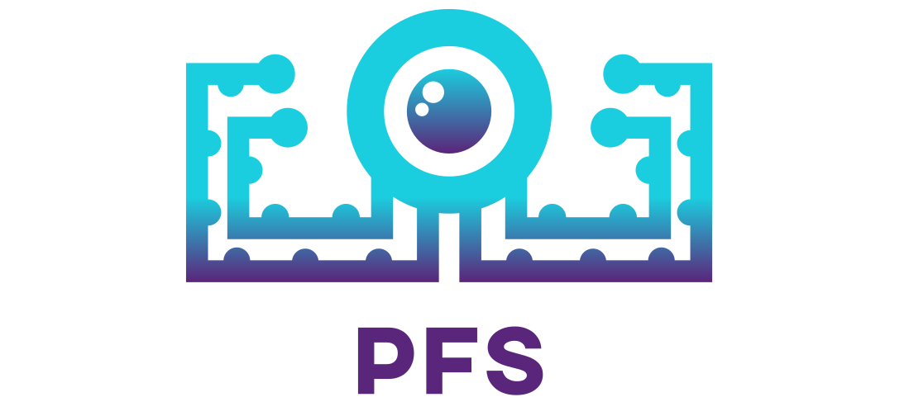

Very easy to use, procfs parsing library in C++.

## Build


Run `cmake . && make`

Currently supported CMake configuration flags:

- `CMAKE_BUILD_TYPE=<Debug|Release>`: Standard CMake flags to control build type (DEFAULT: Debug)
- `BUILD_SHARED_LIBS=<ON|OFF>`: ON to compile a shared library. OFF to compile a static library (DEFAULT: ON)

You can pass any number of those to the `cmake` command: `cmake -D<CONFIG_FLAG>=<VALUE> .`

### Build using clang

If you prefer using clang, just configure the compiler while running cmake:

`CXX=<clang++> CC=<clang> cmake .`

After that, just use `make` as always.

## Integrate

- Compile as a shared or static library.
- Add the contents of `/lib` into your link directories
- Add the contents of `/include` into your include directories.
That's it, you are good to go.

## Features

- Parsing system-wide information from files directly under `/procfs`. See `procfs.hpp` for all the supported files.
- Parsing per-task (processes and threads) information from files under `/procfs/[task-id]/`. See `task.hpp` for all the supported files.
- Parsing network information from files under `/procfs/net` (which is an alias to `/procfs/self/net` nowadays)

## Requirements

- The library requires C++11 or newer
- The library aims to support Linux kernel versions >= 2.6.32.

## Notes

- All APIs and function calls might throw `std::bad_alloc` exceptions when allocations of standard containers such as `std::string` fail.
- APIs are thread-safe. There are no internal states/members/caches that might be affected by simultaneous calls.
- Objects do NOT handle data caching. All the APIs are pure getters that always(!) fetch the information from the filesystem.
- The location of the procfs filesystem is configurable. Just create the `procfs` object with the right path for your machine.

## Samples

The directory `sample` contains a full blown application that calls all(!) the supported APIs and prints all the information gathered. When compiling the library, the sample applications is compiled as well.

Anyway, here are some cool examples:

**Example 1:** Iterater over all the loaded unsigned or out-of-tree kernel modules
```
auto pfs = pfs::procfs();
auto modules = pfs.get_modules();
for (const auto& module : modules)
{
    if (module.is_out_of_tree || module.is_unsigned)
    {
        ... do your work ...
    }
}
```

**Example 2:** Find all the memory maps for task 1234 (This can be both a process or a thread) that start with an ELFs header
```
auto task = pfs::procfs().get_task(1234);
auto mem = task.get_mem();
for (auto& map : task.get_maps())
{
    if (!map.perm.can_read)
    {
        continue;
    }

    static const std::vector<uint8_t> ELF_HEADER = { 0x7F, 0x45, 0x4C, 0x46 };
    if (mem.read(map.start_address, ELF_HEADER.size()) == ELF_HEADER)
    {
        ... do your work ...
    }
}
```
_(You can either create `pfs` every time or once and keep it, the overhead is really small)_

**Example 3:** Iterate over all the IPv4 TCP sockets currently in listening state (in my current network namespace):
```
// Same as pfs::procfs().get_task().get_net().get_tcp()
for (auto& socket : pfs::procfs().get_net().get_tcp())
{
    if (socket.current_state == socket::state::listen)
    {
        ... do your work ...
    }
}
```
_(API behaves similar to the `procfs`, where `/proc/net` is a soft link to `/proc/self/net`)_

**Example 4:** Get all the IPv6 UDP sockets in the root network namespace belonging to a specific user ID:
```
for (auto& socket : pfs::procfs().get_task(1).get_net().get_udp6())
{
    if (socket.uid == <some-uid-value>)
    {
        ... do your work ...
    }
}
```

**Example 5:** Check if the process catches SIGSTOP signals
```
auto status = pfs::procfs().get_task(1234).get_status();
bool handles_sigstop = status.sig_cgt.is_set(pfs::signal::sigstop);
```
